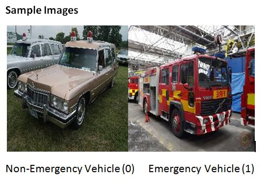

# Hackathon : Computer Vision

## @Rakesh Kumar

#### Email ID : rakesh.sit045@gmail.com

#### Linkedin ID : https://www.linkedin.com/in/rakesh-kumar-gupta-52b77ab4/

## @Trishala Singh

#### Email ID : trishla.singh35@gmail.com

#### Linkedin ID : https://www.linkedin.com/in/trishala-singh-1255522a/

### Model Experiement and Key Point:

1) Sequential
2) Separate Label type images
3) Copy Image from source to target

#### This project has 56.698% accuracy with a rank of 401 in Janta Hackathon (5-Jun-2020).

#### Problem Statement :

https://datahack.analyticsvidhya.com/contest/janatahack-computer-vision-hackathon/#LeaderBoard

### Emergency vs Non-Emergency Vehicle Classification

Fatalities due to traffic delays of emergency vehicles such as ambulance & fire brigade is a huge problem. In daily
life, we often see that emergency vehicles face difficulty in passing through traffic. So differentiating a vehicle into
an emergency and non emergency category can be an important component in traffic monitoring as well as self drive car
systems as reaching on time to their destination is critical for these services.

In this problem, you will be working on classifying vehicle images as either belonging to the emergency vehicle or
non-emergency vehicle category. For the same, you are provided with the train and the test dataset. Emergency vehicles
usually includes police cars, ambulance and fire brigades.

### sample:

### Data Description

train.zip: contains 2 csvs and 1 folder containing image data

train.csv – [‘image_names’, ‘emergency_or_not’] contains the image name and correct class for 1646 (70%) train images

images – contains 2352 images for both train and test sets

test.csv: [‘image_names’] contains just the image names for the 706 (30%) test images

sample_submission.csv: [‘image_names’,’emergency_or_not­’] contains the exact format for a valid submission (1 - For
Emergency Vehicle, 0 - For Non Emergency Vehicle)

### Contact us any time, If you are having any queries.

## Thank you for reaching out to us on Github. 

